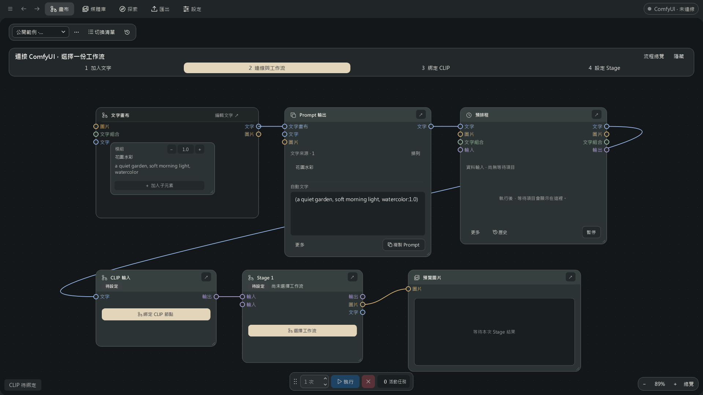

# Prompt Calculus Studio (PCS)

[繁體中文](README.md)

PCS is a Windows desktop tool for organizing reusable prompts and running ComfyUI workflows. Save characters, styles and scenes as modules, edit them in a list or Canvas, and keep your workspaces locally.

## What it does

- Combine prompts with ordering, weights, tag exclusions and manual edits.
- Edit node parameters in a Stage, including CFG, steps, dimensions and supported seeds; save different settings for individual waiting tasks.
- Use Stage nodes to arrange generation steps and pass images from one workflow to the next.
- Queue different prompts, images or groups of steps; reorder or edit waiting items.
- Preview batches, save images and reuse selected results in another workflow.

Image generation uses your own ComfyUI installation, models and workflows. Prompt editing and copying can be used on their own.

## Canvas



Actual PCS 0.8.6 window with public sample text. It shows the starter connections and setup prompts; ComfyUI is not connected.

## What changed

This release unifies navigation and themes across Canvas, media, exploration, export and settings. New workspaces start with six connected nodes; existing layouts are retained. Media details distinguish the viewed image from selected images, waiting tasks can be removed or cancelled individually, and PCS adds bundled-extension installation and Manager package controls.

## Download and start

These instructions cover: **[0.8.6 Alpha 1](https://github.com/gghjkiof36-wq/Prompt-Calculus-Studio/releases/tag/v0.8.6-alpha.1)**.

- `PCS-v0.8.6-Alpha1-source.zip`: the PCS source edition.
- `PCS-v0.8.6-Alpha1-ComfyUI.zip`: the matching ComfyUI extension.
- `SHA256SUMS.txt`: download checksums.

Install 64-bit Python 3.12 on Windows. Extract the source ZIP and open PowerShell beside `run.py`:

```powershell
py -3.12 -m venv .venv
.\.venv\Scripts\python.exe -m pip install -r requirements.txt
.\.venv\Scripts\python.exe run.py --v0.8.6-alpha
```

The first installation downloads dependencies. Once installed, double-click `Start.cmd` from the source archive to start PCS. This release provides the source edition and requires Python; no Windows executable download is included.

The source archive includes the matching extension. In Explore → ComfyUI → Connection and workflows, choose Install/update PCS extension and select your ComfyUI folder. Close ComfyUI for installation, then restart it and refresh its browser page. Follow the Canvas setup prompts to bind CLIP and select the Stage workflow, then press Run. Keep PCS, ComfyUI and the workflow browser page open. See [installation](docs/guide/getting-started.md) and the [ComfyUI guide](docs/guide/comfyui.md) (Chinese).

Back up your data before updating. Extract the new version into a separate folder and use a copy of your data. Use matching PCS and extension versions; see the [version table](docs/releases/README.md) for older names and downloads.

## Stage parameters

Double-click a Stage, select its workflow and node, edit the fields, then review the changes and Apply. Apply saves settings; Run starts generation. Individual waiting tasks can capture different values, such as CFG 3 and 4, and later edits to the Stage do not change those captured settings. See the [Stage guide](docs/guide/stage-parameters.md) (Chinese).

## Usage notes

PCS sends edited text to ComfyUI when you press Run. Without a Stage connection, it only updates the bound inputs. Pause keeps waiting items; jobs already running can still finish. The bottom cancel button cancels the current item and pauses the remaining queue. Use its context menu or the scheduler’s More menu to cancel the whole flow.

For read-only fields, check the displayed reason. After updating the matching extension, restart ComfyUI and refresh its browser page. Configure connected or unsupported fields in ComfyUI. Editable seeds are limited to `1125899906842624` and the node’s own range.

If switching workflows gets stuck, check ComfyUI for running jobs, save the workflow, then refresh the browser page. See [troubleshooting](docs/guide/troubleshooting.md).

For changes, downloads and important problems, see the [release notes](docs/releases/0.8.6/alpha.1.md) (Chinese).

## Support

Report issues with the version and steps at [Issues](https://github.com/gghjkiof36-wq/Prompt-Calculus-Studio/issues). See [CONTRIBUTING](CONTRIBUTING.md) and [SECURITY](SECURITY.md) for development and private security reports.

## License

[AGPL-3.0-only](LICENSE)
