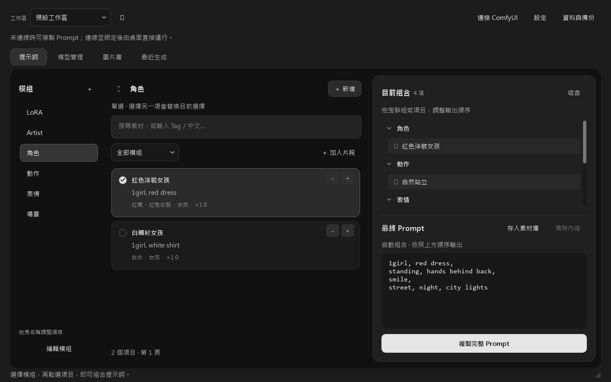

# Prompt Calculus Studio（PCS）

**化繁為簡，從混亂中找出秩序。**

把常用提示詞整理成模組，選取素材、調整順序與權重，再送入 ComfyUI 工作流。Prompt Calculus Studio（原名 Prompt Studio）是以本機資料為主的 Windows 桌面工具，也提供 ComfyUI 側邊欄擴充，方便保存角色、風格與場景組合。

[開始使用](docs/GETTING_STARTED.md) · [操作指南](docs/USER_GUIDE.md) · [ComfyUI 整合](COMFYUI_GUIDE.md) · [回報問題](https://github.com/gghjkiof36-wq/modular-prompt-manager/issues)

目前為早期開發階段，尚未發布正式 1.0。以下功能與操作以本儲存庫公開主分支為準。**已有 [0.81 Alpha 2 UI Repair 1 預覽版](https://github.com/gghjkiof36-wq/modular-prompt-manager/releases/tag/v0.81-alpha.2-ui-repair.1)**，提供該版原始碼、ComfyUI 擴充及校驗檔；Windows EXE 尚未公開。

### 版本與維護現況

截至 2026-09-15，公開主分支、0.81 Release 與本機開發成果分別維護，下載時請確認版本：

- **公開主分支**：下方清單介面及安裝步驟所對應的程式；「Code → Download ZIP」取得這份原始碼。
- **公開 0.81 預覽版**：已包含 Canvas、CivitAI 搜尋／下載及相關介面修正，請從上述 Release 取得配套來源與擴充，依該頁指示啟動。
- **本機 0.82 Repair4（`9cea7f4`）**：已完成本輪本機維護與隔離資料回復驗收，涵蓋工作流刪除／復原、圖片來源及同步保護等修復；尚未整合公開主分支或發布。這些本機結果不代表 GitHub CI、真實 ComfyUI／GPU 或所有 Windows 環境皆已驗證。

未來方向見 [Roadmap](ROADMAP.md)；其中舊規劃請結合本頁與實際 Release 閱讀。歷史 Prompt Studio 名稱、儲存庫網址、節點及資料識別保留相容用途。

## 能做什麼

- **組合 Prompt**：建立自己的模組與素材，調整輸出順序、權重及排除 Tag，並保留臨時片段與手動稿。
- **保存工作區**：為不同用途保存固定組合及模型、採樣參數建議。
- **整理本機素材**：瀏覽模型檔案、記錄觸發詞，管理圖片及讀取 PNG 生成資料。
- **接到 ComfyUI**：在側邊欄綁定文字欄位，將模組組合寫回工作流；啟用桌面控制後，可從桌面送出生成並查看、收藏結果。
- **保留生成脈絡**：透過擴充保存模組快照，在支援的 PNG 中讀回歷史組合。

桌面提示詞與素材管理不需要載入 AI 模型。圖片生成由你自己的 ComfyUI 執行，硬體需求取決於工作流與模型。

## 介面



使用本儲存庫公開程式與內建範例資料擷取；未連接 ComfyUI、未載入個人素材。這張圖展示公開主分支的清單介面，保留原始截圖；不代表 0.81 Canvas 或尚未公開的 0.82 畫面。

## 下載與安裝

要使用公開 **0.81 預覽版**，下載 [Release](https://github.com/gghjkiof36-wq/modular-prompt-manager/releases/tag/v0.81-alpha.2-ui-repair.1) 中的 `PromptStudio-v0.81-alpha.2-ui-repair.1-source.zip`，需要 ComfyUI 時另取 `PromptStudio-v0.81-ComfyUI.zip`；`SHA256SUMS.txt` 可核對附件。請依該 Release 的啟動指令操作，來源 ZIP 不包含 EXE。

以下步驟適用**公開主分支**：

準備 Windows 64 位元與 Python 3.12，下載本儲存庫原始碼並解壓。在專案資料夾開啟 PowerShell，執行：

```powershell
py -3.12 -m venv .venv
.\.venv\Scripts\python.exe -m pip install -r requirements.txt
.\.venv\Scripts\python.exe run.py
```

不需要啟用虛擬環境。詳細步驟、桌面捷徑與啟動問題請看 [安裝指南](docs/GETTING_STARTED.md)。ComfyUI 擴充需另行建立安裝包，請依 [擴充安裝步驟](COMFYUI_GUIDE.md) 操作。

## 第一次組合提示詞

1. 在左側選擇「角色」，點選一個範例素材。
2. 再選擇動作、表情與場景，右側會即時組合 Prompt。
3. 在「目前組合」調整順序與權重，或加入臨時片段。
4. 按「複製完整 Prompt」使用結果。需要由桌面生成時，先完成 ComfyUI 綁定。

直接編輯輸出框會保留為手動版本。要恢復自動組合，使用「清除內容」；原先選取的素材仍會保留。

## 文件與支援

| 想做的事 | 文件 |
|---|---|
| 安裝、啟動及建立捷徑 | [開始使用](docs/GETTING_STARTED.md) |
| 模組、工作區、模型及圖片管理 | [操作指南](docs/USER_GUIDE.md) |
| 綁定工作流、桌面生成及收藏 | [ComfyUI 整合](COMFYUI_GUIDE.md) |
| 找到資料、備份或了解聯網行為 | [資料與隱私](docs/DATA_AND_PRIVACY.md) |
| 排除啟動或連線問題 | [疑難排解](docs/TROUBLESHOOTING.md) |
| 查看更新與未來方向 | [更新紀錄](CHANGELOG.md)、[Roadmap](ROADMAP.md) |
| 回報問題或參與開發 | [貢獻指南](CONTRIBUTING.md)、[安全問題](SECURITY.md) |

## 授權

本專案採用 [GNU AGPL v3.0 only](LICENSE)，識別碼為 `AGPL-3.0-only`。依授權條款可使用、修改及散布，也允許商業使用。另行提供商業授權的方案仍在規劃中，目前沒有可直接套用的商業授權合約。詳見 [授權說明](docs/LICENSING.md)。
